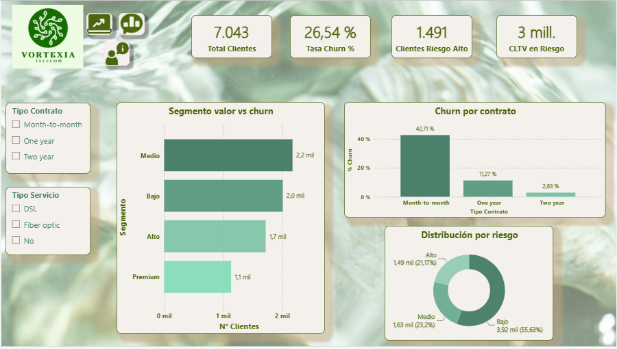
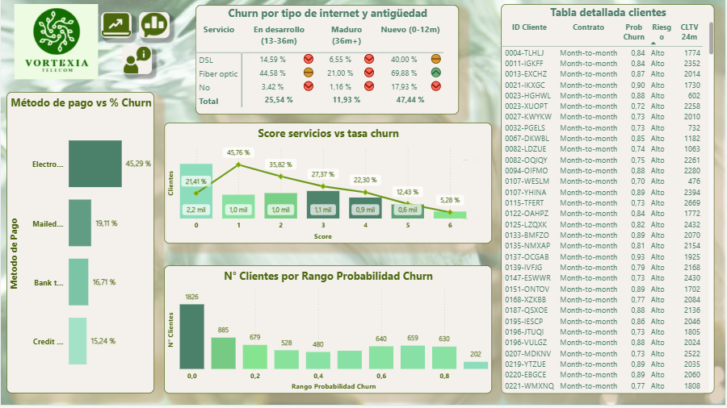
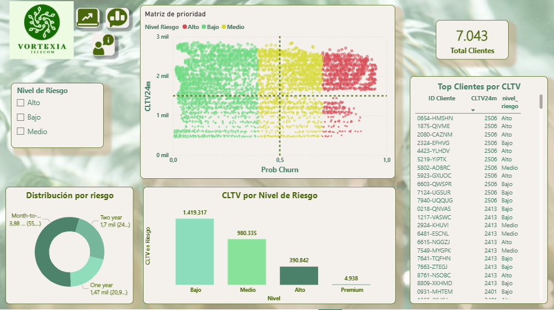

# 📊  Dashboard de Retención de Clientes

Proyecto de analítica de datos enfocado en la construcción de un **dashboard ejecutivo en Power BI**, orientado a la **detección de churn (abandono de clientes)** y la **optimización de estrategias de retención** en una empresa de telecomunicaciones.

Este proyecto integra un flujo completo de análisis: desde **SQL y Python hasta visualización en Power BI**.

---

## 🧩 Contexto del negocio

**Vortexia Telecom** es una empresa de telecomunicaciones B2C que ofrece servicios de internet y telefonía a clientes entre 18 y 65+ años, bajo un modelo de suscripción con distintos tipos de contrato y servicios.

En un mercado altamente competitivo, enfrenta el desafío de crecer de forma sostenible, optimizando la **retención de clientes**, el **CLTV** y el **ingreso recurrente (MRR)**.

La **alta tasa de churn**, especialmente en clientes con baja antigüedad y contratos flexibles, impacta directamente en los ingresos y eleva los costos de adquisición.

Por ello, es clave identificar clientes en riesgo, entender los factores de abandono y priorizar estrategias de retención basadas en datos.

---

## 🎯 Objetivo del proyecto

Desarrollar una solución analítica end-to-end que permita:

- Predecir la **probabilidad de churn**
- Segmentar clientes según su **nivel de riesgo**
- Identificar **drivers clave del abandono**
- Construir un **dashboard interactivo en Power BI**
- Generar **insights accionables para negocio**

---

## 🛠️ Stack tecnológico

- **SQL** → Limpieza, transformación y creación de features  
- **Python (Pandas, Scikit-learn)** → Modelado predictivo (Churn)  
- **Power BI** → Visualización y storytelling  
- **Excel / CSV** → Integración de datos  

---

## 🧩 Arquitectura del Proyecto

El proyecto sigue un pipeline completo de analítica:

1. **Extracción y exploración de datos (SQL)**
2. **Limpieza y transformación (SQL)**
3. **Feature engineering (SQL)**
4. **Modelado predictivo (Python)**  
   - Regresión Logística  
   - Random Forest  
5. **Scoring de clientes (probabilidad de churn)**
6. **Visualización en Power BI**

**Output final:**
- `customers_scored.csv` con:
  - `prob_churn`
  - `pred_churn`
  - `nivel_riesgo`

---

## 📸 Dashboard




---

## 📈 Principales hallazgos

- Los clientes con **contrato mensual** presentan mayor churn  
- La **baja antigüedad (<12 meses)** aumenta el riesgo  
- Clientes con **pocos servicios** tienen menor retención  
- El método de pago influye en el churn  
- Existe un segmento de **alto valor (CLTV) en riesgo**

---

## 📁 Estructura del repositorio

```text
Churn y Retención/
├── Assets/
│   └── Analisis_Segmento.PNG
│   └── Estrella.PNG
│   └── feature_importance.png
│   └── Informe_General.PNG
│   └── Retencion_Prioritario.PNG
├── Data/
│   └── customers_scored.csv
│   └── v_churn_internet_antiguedad.csv
│   └── v_churn_por_contrato.csv
│   └── v_prioridad_retencion.csv
│   └── v_servicios_vs_churn.csv
│   └── WA_Fn-UseC_-Telco-Customer-Churn.csv
├── Docs/
│   ├── 01_problema_y_objetivos.md
│   ├── 02_diccionario_de_datos.md
│   ├── 03_metodologia.md
│   └── 04_hallazgos_y_recomenda.md
├── Powerbi/
│   └── Churn y Retención.pbix
│   └── Modelo de Datos.md
├── Python/
│   └── analisisproyecto3.ipynb
│   └── Procesamiento y Análisis en Python.md
├── SQL/
│   └── 01_exploracion.sql
│   └── 02_limpieza.sql
│   └── 03_features.sql
│   └── 04_vistas_powerbi.sql
│   └── Procesamiento y Análisis en SQL.md
└── README.md
```

---

## 📈 Insights clave

- **La flexibilidad contractual incrementa el churn**  
  Los clientes con contratos mensuales presentan significativamente mayor abandono, evidenciando menor compromiso y mayor sensibilidad a la competencia.

- **La antigüedad es un factor crítico de retención**  
  Los clientes con menor tenure concentran el mayor riesgo de churn, destacando la importancia de fortalecer las etapas tempranas del ciclo de vida.

- **El nivel de vinculación impacta la permanencia**  
  Clientes con múltiples servicios contratados muestran menor churn, mientras que aquellos con baja adopción tienen mayor probabilidad de abandono.

- **Existe un segmento de alto valor en riesgo**  
  Se identifican clientes con alto gasto mensual (alto CLTV) que presentan elevada probabilidad de churn, representando un riesgo directo para los ingresos.

- **El método de pago influye en la retención**  
  Clientes con pagos automáticos tienden a ser más estables, mientras que métodos manuales se asocian a mayor churn.

- **El churn es predecible y accionable**  
  Los patrones identificados permiten anticipar el abandono y diseñar estrategias de retención focalizadas en segmentos críticos.

---

## 💡 Recomendaciones de negocio

- **Fomentar la migración a contratos de mayor duración**  
  Incentivar el paso de contratos mensuales a anuales mediante descuentos o beneficios exclusivos para aumentar la retención.

- **Fortalecer el onboarding de nuevos clientes**  
  Implementar estrategias tempranas (primeros 3-6 meses) como seguimiento proactivo, educación del servicio y ofertas personalizadas.

- **Desarrollar bundles de servicios**  
  Promover paquetes combinados (internet, soporte técnico, seguridad, etc.) para incrementar la vinculación y reducir la probabilidad de churn.

- **Incentivar métodos de pago automáticos**  
  Ofrecer beneficios por domiciliación o pagos automáticos, reduciendo fricción y mejorando la estabilidad del cliente.

- **Priorizar clientes de alto valor en riesgo**  
  Diseñar campañas específicas para clientes con alto CLTV y alta probabilidad de churn (ofertas personalizadas, atención preferencial).

- **Implementar campañas de retención basadas en datos**  
  Utilizar el scoring de churn para segmentar clientes y ejecutar acciones focalizadas en los grupos más críticos.

---

## 🚀 Impacto esperado

- **Reducción del churn rate**  
  Disminución significativa del abandono mediante acciones proactivas y segmentadas.

- **Incremento del Customer Lifetime Value (CLTV)**  
  Mayor permanencia y consumo de servicios por cliente.

- **Optimización del ingreso recurrente (MRR)**  
  Mayor estabilidad en los ingresos a través de clientes más fidelizados.

- **Mejor eficiencia en inversión comercial**  
  Enfoque en retención y clientes de alto valor, reduciendo costos de adquisición innecesarios.

- **Toma de decisiones basada en datos**  
  Uso del dashboard como herramienta clave para áreas de negocio, marketing y estrategia.

- **Mayor capacidad predictiva del negocio**  
  Anticipación del churn y reacción oportuna frente a riesgos.
